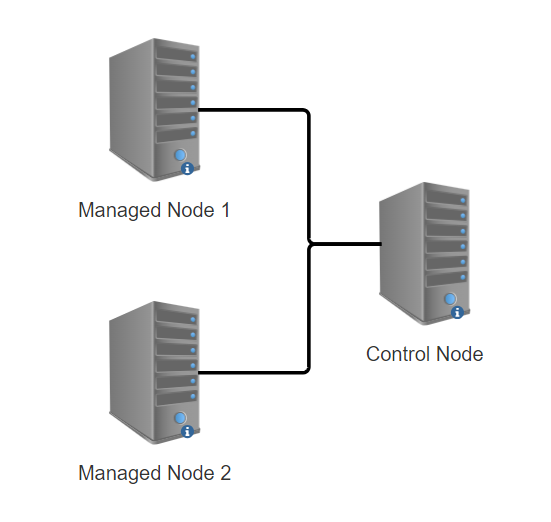

# Prerequisites

## Table of Contents

1. [Topologi](#topologi)
1. [Pelatihan Deployment](#pelatihan-deployment)

## Topologi

Berikut adalah Topologi yang kita gunakan pada materi kali ini:

Pembuatan topologi bersifat opsional, tetapi tetap **DISARANKAN** agar dapat mengikuti dan memahami materi dengan baik.

Cara pembuatan VM **DIBEBASKAN**, baik secara local (vmware, virtual box, wsl, dll) maupun cloud (aws, azure, digital ocean, dll).

### Berikut adalah beberapa referensi untuk pembuatan vm pada tiap-tiap platform
Azure:
https://learn.microsoft.com/en-us/azure/virtual-machines/windows/quick-create-portal

AWS:
https://docs.aws.amazon.com/AWSEC2/latest/UserGuide/EC2_GetStarted.html

WSL:
https://learn.microsoft.com/en-us/windows/wsl/install

Virtual Box:
https://ubuntu.com/tutorials/how-to-run-ubuntu-desktop-on-a-virtual-machine-using-virtualbox#1-overview

VMware
https://www.makeuseof.com/install-ubuntu-on-vmware-workstation/

_*Untuk Virtual Box dan VMware, ikuti network setting pada pelatihan Deployment [disini](https://github.com/arsitektur-jaringan-komputer/modul-deployment/tree/master/0.%20Prerequisites#catatan)_

## Pelatihan Deployment

Sangat **DISARANKAN** untuk menyelesaikan deployment Front End dan Back End yang ada pada pelatihan [Deployment Deep Dive](https://github.com/arsitektur-jaringan-komputer/modul-deployment) karena berhubungan dengan materi [Deployment With Ansible](https://github.com/arsitektur-jaringan-komputer/modul-ansible/tree/master/4.%20Deployment%20With%20Ansible)
